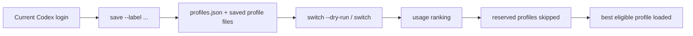

<div align="center">

# codex-switcher

Manage multiple Codex CLI accounts with fast switching, usage-aware ranking, and reserved profiles for dedicated workloads.

[](https://github.com/1Voin1/codex-switcher/actions/workflows/tests.yml)
[](https://github.com/1Voin1/codex-switcher/releases)
[](LICENSE)
[](https://github.com/1Voin1/codex-switcher/tree/develop)

<p>
  <a href="#why-it-exists"><strong>Why It Exists</strong></a> |
  <a href="#install"><strong>Install</strong></a> |
  <a href="#quick-start"><strong>Quick Start</strong></a> |
  <a href="#what-makes-it-useful"><strong>Features</strong></a> |
  <a href="#commands"><strong>Commands</strong></a> |
  <a href="#development"><strong>Development</strong></a>
</p>

</div>

---

## Why It Exists

`codex-switcher` is the maintained repository for a profile manager around Codex CLI
authentication. It preserves `codex-profiles` package compatibility while recommending
the `codex-switcher` binary for side-by-side use.

> This repository is based on the original
> [`codex-profiles`](https://github.com/midhunmonachan/codex-profiles) project
> and extends it with local workflow changes, reserved-profile support, and
> repository-specific release and documentation cleanup.

### What problem it solves

If you work across multiple Codex accounts, local machines, VPS agents, or parallel
automation, you usually need more than "login once and overwrite auth.json".

`codex-switcher` gives you a cleaner operating model:

| Need | What `codex-switcher` does |
| --- | --- |
| Keep several Codex accounts on one machine | Saves each login as a reusable local profile |
| Avoid burning the wrong account during auto-switch | Ranks candidates by remaining 7d and 5h limits |
| Reserve VPS or agent accounts | Excludes marked profiles from normal auto-switch |
| Run side-by-side with existing setups | Supports a separate storage home and alternate auth dir |
| Recover login callbacks cleanly | Relays an existing Roo or Codex callback URL into a local listener |

## What Makes It Useful

<table>
  <tr>
    <td width="50%">
      <strong>Usage-aware switching</strong><br />
      Choose the best account by remaining quota instead of switching blindly.
    </td>
    <td width="50%">
      <strong>Reserved profiles</strong><br />
      Keep dedicated accounts for OpenClaw, VPS agents, or background jobs.
    </td>
  </tr>
  <tr>
    <td width="50%">
      <strong>Parallel-safe setup</strong><br />
      Read auth from one Codex home and store profiles in another.
    </td>
    <td width="50%">
      <strong>Login relay support</strong><br />
      Forward an existing callback URL into the local Codex login listener.
    </td>
  </tr>
</table>

## Requirements

- [Codex CLI](https://developers.openai.com/codex/cli/)
- One of:
  - ChatGPT subscription for Codex login
  - OpenAI API key

## Install

### Preferred command name

This repository publishes both command names:

- `codex-switcher`
- `codex-profiles`

For new setups, prefer `codex-switcher`.

### Package installs

| Source | Command |
| --- | --- |
| npm | `npm install -g codex-profiles` |
| Bun | `bun install -g codex-profiles` |
| Cargo | `cargo install codex-profiles` |

### Manual install

```bash
curl -fsSL https://raw.githubusercontent.com/1Voin1/codex-switcher/develop/install.sh | bash
```

## Quick Start

### 1. Save the current login

```bash
codex-switcher save --label work
```

### 2. Load a saved login

```bash
codex-switcher load --label work
```

### 3. Preview the best profile

```bash
codex-switcher switch --dry-run
```

### 4. Reserve dedicated accounts

```bash
codex-switcher reserve --label openclaw-raymond
codex-switcher reserve --label openclaw-benjamin
```

## How It Works



## Commands

| Command | Purpose |
| --- | --- |
| `save [--label <name>]` | Save the current `auth.json` as a named profile. |
| `load [--label <name>]` | Load a saved profile from the picker or by label. |
| `list` | Show saved profiles ordered by last use. |
| `status [--current] [--all] [--label <name>]` | Show usage details and ranking state. |
| `switch [--dry-run] [--reload-ide]` | Pick the best non-reserved profile from remaining limits. |
| `reserve --label <name>` | Mark a saved profile as excluded from auto-switch. |
| `unreserve --label <name>` | Remove the exclusion and allow auto-switch again. |
| `migrate [--from <path>] [--overwrite]` | Copy profiles from another Codex directory into this storage. |
| `delete [--yes] [--label <name>]` | Remove saved profiles without logging out the current session. |
| `relay-login [--url <callback_url>]` | Relay an existing Roo or Codex callback URL into a running local listener. |

## Reserved Profiles

Reserved profiles are still visible, loadable, and queryable. They are simply
excluded from the automatic candidate pool used by `switch`.

Typical use cases:

- keep 1 or 2 accounts dedicated to background agents
- let local auto-switch ignore those accounts
- manually load a reserved account only when explicitly needed

`switch --dry-run` shows reserved profiles with a `[reserved]` marker.

## Storage Model

By default, saved profiles live under `~/.codex/profiles/`.

| File | Purpose |
| --- | --- |
| `{email-plan}.json` | Saved profile payload |
| `profiles.json` | Labels, active profile, last-used time, reservation state |
| `profiles.lock` | File lock for safe concurrent updates |

### Relevant environment variables

| Variable | Purpose |
| --- | --- |
| `CODEX_PROFILES_HOME` | Alternate storage root for saved profiles |
| `CODEX_PROFILES_AUTH_DIR` | Alternate auth/config source directory |
| `CODEX_PROFILES_ENABLE_UPDATE=1` | Opt in to startup update checks |

### Parallel install example on Windows

```powershell
$env:CODEX_PROFILES_AUTH_DIR = "$env:USERPROFILE\\.codex"
$env:CODEX_PROFILES_HOME = "$env:USERPROFILE\\codex-switcher-home"
codex-switcher migrate
```

## Relay Login

Use `relay-login` only when the normal login flow is already running in another terminal.

Accepted callback URLs must:

- use `http`
- target `localhost` or `127.0.0.1`
- include an explicit port
- use the exact path `/auth/callback`
- include non-empty `code` and `state` query values

Example:

```bash
codex-switcher relay-login --url "http://localhost:1455/auth/callback?code=...&state=..."
```

## Development

### Core local checks

```bash
make precommit
```

### Other useful targets

```bash
make fmt
make clippy
make test
make coverage
```

Community and maintenance docs:

- [CONTRIBUTING.md](CONTRIBUTING.md)
- [SECURITY.md](SECURITY.md)
- [CODE_OF_CONDUCT.md](CODE_OF_CONDUCT.md)
- [docs/process/release-checklist.md](docs/process/release-checklist.md)
- [docs/process/release-strategy.md](docs/process/release-strategy.md)

## FAQ

<details>
<summary><strong>Is my auth file uploaded anywhere?</strong></summary>

No. The tool copies files locally and keeps credentials on your machine.

</details>

<details>
<summary><strong>Does deleting a profile log me out?</strong></summary>

No. It only removes the saved profile snapshot from the local store.

</details>

<details>
<summary><strong>Can I keep personal, work, and VPS accounts separate?</strong></summary>

Yes. Save each account with a distinct label and reserve dedicated accounts when
you do not want automatic switching to use them.

</details>
